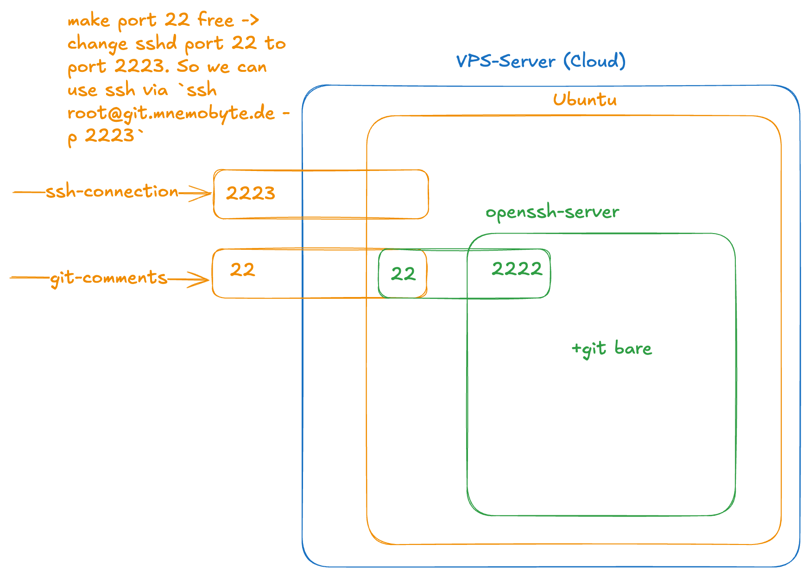

# Hosting git

## Solution



## VPS Firewall Configuration

For this task, I set up a VPS server with an Ubuntu image. After defining all incoming and outgoing firewall rules, I cloned my project from GitHub and started it via Gradle.

The firewall configuration was crucial for proper operation:

### Incoming Rules (Inbound Traffic)

| Port | Protocol | Purpose |
|------|----------|---------|
| 22 | TCP | SSH access to VPS (Ubuntu host) |
| 80 | TCP | HTTP (optional, for future web services) |
| 443 | TCP | HTTPS (optional, for future web services) |
| 2223 | TCP | SSH access to Ubuntu (moved from default 22 to free up port 22 for Docker) |

**Note**: Port 22 is forwarded to the Docker container (port 2222) for the Git SSH server, while the Ubuntu host SSH runs on port 2223.

### Outgoing Rules (Outbound Traffic)

| Port | Protocol | Purpose |
|------|----------|---------|
| 53 | UDP | **DNS** - Required for domain name resolution (critical for `apk`, `apt`, etc.) |
| 80 | TCP | **HTTP** - Required for Alpine package manager (`apk`) inside Docker container |
| 123 | UDP | **NTP** - Time synchronization |
| 443 | TCP | **HTTPS** - Secure connections (Docker pull, git clone, package updates) |
| * | ICMP | **Ping/Diagnostics** - Network troubleshooting |

### Critical Learning: DNS is UDP Port 53

Initially, Docker builds failed with `Socket not connected` errors when trying to install packages. The issue was missing outbound firewall rules:

1. **UDP 53 (DNS)** - Without this, containers cannot resolve domain names like `dl-cdn.alpinelinux.org`
2. **TCP 80 (HTTP)** - Alpine's package repositories use HTTP by default
3. **ICMP** - Used for ping diagnostics (not strictly required for functionality)

### Why These Ports Matter

- **DNS (UDP 53)**: First step in any network request - translates hostnames to IP addresses
- **HTTP (TCP 80)**: Alpine Linux packages are distributed over HTTP (not HTTPS)
- **HTTPS (TCP 443)**: Most modern services use encrypted connections
- **NTP (UDP 123)**: Keeps system time accurate (important for TLS certificates, logs, etc.)
- **ICMP**: Enables ping for network diagnostics

---

Start the Dockerfile:

```shell
$ docker build \
  --build-arg USER_NAME="hack" \
  --build-arg PUBLIC_KEY="$(cat ~/.ssh/id_rsa.pub)" \
  --build-arg REPO_PATH="folly/woot.git" \
  -t challenge-image .
  
$ docker run -d \
  --name openssh-server \
  -p 22:2222 \
  challenge-image
```

Test the repo:

```shell
$ mkdir test-repo && cd test-repo
$ git init
$ echo 'hello world!' >> README.md
$ git add README.md
$ git commit -m "adds README"

$ git remote add origin hack@localhost:folly/woot.git
$ git push origin main
Enumerating objects: 3, done.
Counting objects: 100% (3/3), done.
Writing objects: 100% (3/3), 219 bytes | 219.00 KiB/s, done.
Total 3 (delta 0), reused 0 (delta 0), pack-reused 0
To localhost:folly/woot.git
 * [new branch]      main -> main
```

If you see an warning like `REMOTE HOST IDENTIFICATION HAS CHANGED!` just:

```shell
$ ssh-keygen -R localhost
```

It deletes all saved keys for localhost from my known_hosts file. I want to re-verify my identity next time.

---

1. I need a ssh-server, maybe with: `$ docker pull linuxserver/openssh-server:version-10.2_p1-r0`
2. I need a bare repo, maybe with: `$ git init --bare test.git`

This time I want to set variables dynamically to a dockerfile, for example:

```dockerfile
FROM alpine:latest

ARG USERNAME
ENV USERNAME=${USERNAME}

RUN adduser -D ${USERNAME}
```

## Generate ssh-key for testing

```shell
$ ssh-keygen -t ed25519 -C "your_email@example.com" -f ./my_key
ssh-ed25519 AAAAC3N...ZRYkMZ your_email@example.com
```

## Interactive openssh-server

```shell
$ docker run -d --name openssh-server \
  -e "PUBLIC_KEY=ssh-ed25519 AAAAC3N...ZRYkMZ your_email@example.com" \
  -p 2222:2222 \
  linuxserver/openssh-server:latest
```

But, you can also copy the ssh key to `/config/.ssh/authorized_keys` in the container. However,
then you have to restart the server (I guess).

Important:

> 1. For the challenge we need also the env e.g. `-e "USER_NAME=john"` in the command, otherwise,
the we have to take `linuxserver.io`!
> 2. we have to change the port from 2222 to 22, because git will use 22 for ssh ⇒ -p 22:2222
> 3. then, we haven't add the prefix `ssh://` as well
> 4. maybe, we will not need the symlink (see below), because /config is my home directory in the container

## Connect with openssh-server

```shell
# first check the logs
$ docker logs openssh-server                                                                                                                                                                         ⏎
[migrations] started
[migrations] no migrations found
usermod: no changes
───────────────────────────────────────

      ██╗     ███████╗██╗ ██████╗
      ██║     ██╔════╝██║██╔═══██╗
      ██║     ███████╗██║██║   ██║
      ██║     ╚════██║██║██║   ██║
      ███████╗███████║██║╚██████╔╝
      ╚══════╝╚══════╝╚═╝ ╚═════╝

   Brought to you by linuxserver.io
───────────────────────────────────────
...
User name is set to linuxserver.io

# you can see the name of the host
$ ssh -p 2222 -i my_key linuxserver.io@localhost
Welcome to OpenSSH Server
6aaa0846713f:~$ ls
logs  ssh_host_keys  sshd  sshd.pid
```

## Now, let's create a bare repository

take a look at: https://stackoverflow.com/questions/7632454/how-do-you-use-git-bare-init-repository

```shell
# enter the shell of your ssh server
$ ssh -p 2222 -i my_key linuxserver.io@localhost
Welcome to OpenSSH Server

# first install git
68e5d2be888d:~$ sudo apk update
68e5d2be888d:~$ sudo apk add git

# init bare repo
68e5d2be888d:~$ git init --bare repo.git
...
Initialized empty Git repository in /config/repo.git/
```

## Test your first push

```shell
# first, commit your first file
$ mkdir test-repo
$ cd test-rep
$ git init
$ echo 'hello world!' >> README.md
$ git add README.md
$ git commit -m "adds README"

# add the openssh-server to your remote
$ git remote add origin ssh://linuxserver.io@localhost:2222/config/repo.git
$ git config --get remote.origin.url
ssh://linuxserver.io@localhost:2222/config/repo.git

# I use this, 'cause I won't add my test ssh key to my keychain
$ GIT_SSH_COMMAND="ssh -i ../my_key -o StrictHostKeyChecking=no" git push origin main
Enumerating objects: 3, done.
Counting objects: 100% (3/3), done.
Writing objects: 100% (3/3), 227 bytes | 227.00 KiB/s, done.
Total 3 (delta 0), reused 0 (delta 0), pack-reused 0
To ssh://localhost:2222/config/repo.git
 * [new branch]      main -> main
```

## Check the repo in the container

```shell
68e5d2be888d:~$ git -C /config/repo.git log main
commit 0b2127bec61f769cd92af4a2e4dfc1af781e2cb5 (main)
Author: schipet <schillpeet@gmail.com>
Date:   Thu Feb 12 19:06:32 2026 +0100

    adds README
```

## last issue

The challenge says `The final repo URL we try connecting to is usually something like 
hack@<repo_host>:folly/woot.git (here for username = hack and repo_path = folly/woot.git).`.
