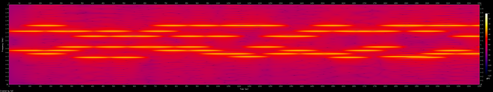
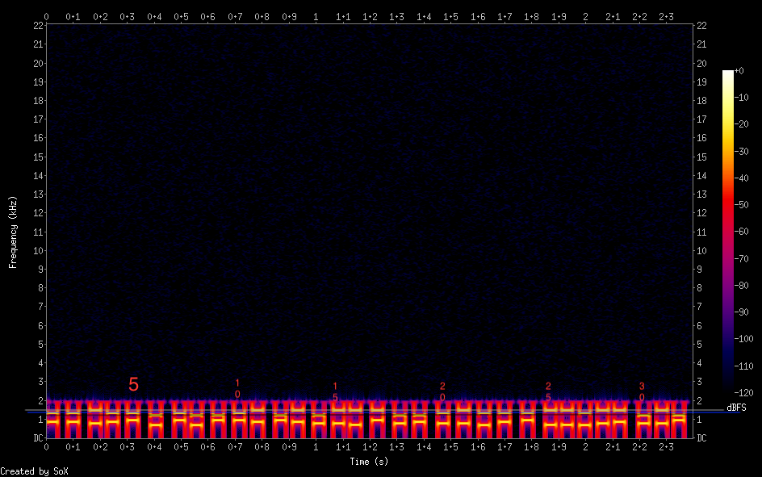

# Touch-Tone dialing

I tried to use `be.tarsos.dsp` but I didn't find an easy solution. But
I found an interesting tool `multimon-ng` (https://github.com/EliasOenal/multimon-ng).

## building

```shell
$ mkdir build
$ cd build
$ cmake ..
$ make
$ sudo make install
$ sudo mv multimon-ng /usr/local/bin
# refresh terminal...
```

For example, download on wikipedia a DTMF file and convert it to wav, after that:

```shell
$ multimon-ng -t wav -a DTMF dtmf_example.wav                                                                                                                                         ⏎
multimon-ng 1.5.0
  (C) 1996/1997 by Tom Sailer HB9JNX/AE4WA
  (C) 2012-2026 by Elias Oenal
Available demodulators: POCSAG512 POCSAG1200 POCSAG2400 FLEX FLEX_NEXT EAS UFSK1200 CLIPFSK FMSFSK AFSK1200 AFSK2400 AFSK2400_2 AFSK2400_3 HAPN4800 FSK9600 DTMF ZVEI1 ZVEI2 ZVEI3 DZVEI PZVEI EEA EIA CCIR MORSE_CW DUMPCSV X10 SCOPE
Enabled demodulators: DTMF
DTMF: 9
DTMF: 4
DTMF: 5
DTMF: 4
DTMF: 7
DTMF: 3
DTMF: 3
DTMF: 4
DTMF: 2
```

voilà! but... for the touch-tone dialing wav file this doesn't work. So let us
analyze, why not...

```shell
$ multimon-ng -t wav -a DTMF touch_tone_dialing.wav | grep "DTMF:" | awk '{print $2}' | tr -d '\n'
8868011011*09*9463#4756228033226946
```

Let's compare the wikipedia and the challenge wav file with `sox`:

```shell
$ sox --i dtmf_example.wav                                                                                                                  ✹

Input File     : 'dtmf_example.wav'
Channels       : 1
Sample Rate    : 44100
Precision      : 16-bit
Duration       : 00:00:20.00 = 882001 samples = 1500 CDDA sectors
File Size      : 1.76M
Bit Rate       : 706k
Sample Encoding: 16-bit Signed Integer PCM

$ sox --i touch_tone_dialing.wav                                                                                                            ✹

Input File     : 'touch_tone_dialing.wav'
Channels       : 1
Sample Rate    : 4000
Precision      : 16-bit
Duration       : 00:00:02.40 = 9604 samples ~ 180.075 CDDA sectors
File Size      : 19.3k
Bit Rate       : 64.1k
Sample Encoding: 16-bit Signed Integer PCM
```

## Create spectrogram for analyzing

```shell
$ sox touch_tone_dialing.wav -n spectrogram -o spectrogram_touch_tone_dialing.png
$ multimon-ng -t wav -a DTMF touch_tone_dialing.wav | grep "DTMF:" | awk '{print $2}' | tr -d '\n'
8868011011*09*9463#4756228033226946*
``` 



There are overlaps, which is why I will do a resampling.

### Resampling

```shell
$ sox touch_tone_dialing.wav -r 44100 touch_44k.wav
$ sox touch_44k.wav -n spectrogram -o spectrogram_touch_44k.png
$ multimon-ng -t wav -a DTMF touch_44k.wav | grep "DTMF:" | awk '{print $2}' | tr -d '\n'
8868011011*09*9463#4756228033226946*
```



Although we see an exact representation of the bars (samples) without overlaps, it had no effect on the result.

Since I only have the digits 0-9 and the special characters * and #, the values for the lower range are only 
between 697 and 941, and for the upper range, between 1209 and 1477. I analyzed the spectrogram in detail 
using the numbers: `8868011011*09*9463#4756228033226946*`

As we can see, the string contains 36 characters instead of the expected 32 characters, which we can also count 
in the spectrogram. My observation yielded the following, with c as correct and w as wrong:

```
8868011011*09*9463#4756228033226946*
ccccccw -> remove a single 1
886801011*09*9463#4756228033226946*
ccccccccw -> remove a single 1
88680101*09*9463#4756228033226946*
ccccccccccccccccccccccw -> remove a single 2
88680101*09*9463#475628033226946*
cccccccccccccccccccccccccccw -> remove a single 2
88680101*09*9463#47562803326946*
cccccccccccccccccccccccccccccccc
```

The correct string with 32 characters is: `88680101*09*9463#47562803326946*`

We see that the string also contains correct duplicate characters, like the two 8s or the two 3s.

Considerations:

All numbers are correctly recognized, only the 1s and 2s are counted twice. Is it due to the low tone 697? 
No, otherwise the 3 would also have been doubled. It's a dirty workaround, but I simply filter the result 
⇒ anything that is a 1 or 2 and appears twice in a row is deleted...

...it worked. 😄

